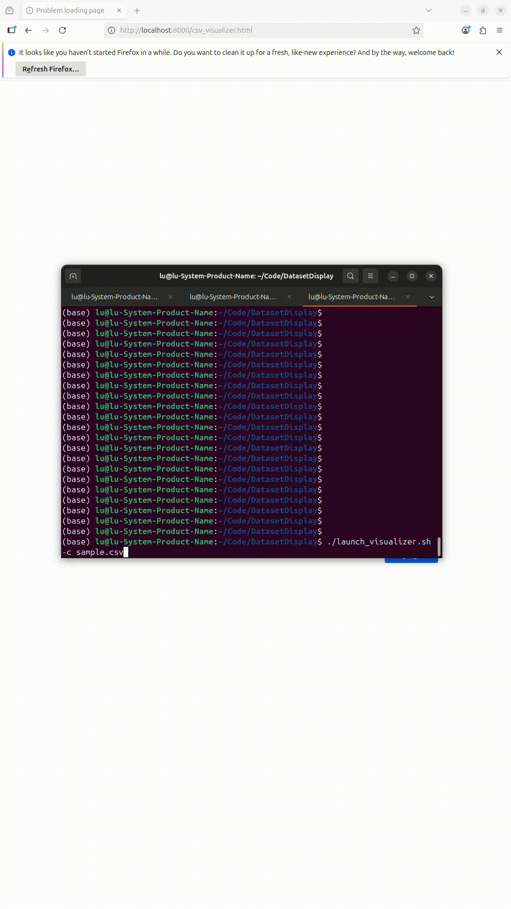

# CSV Data Visualizer

A powerful webpage-based visualization tool for displaying and labeling CSV data. This tool provides two modes: **View Mode** for exploring data and **Label Mode** for adding labels to your dataset.


## 🖼️ Demo



## 🎯 Features

### View Mode
- **Column Blocks**: Each CSV column is displayed as a separate block on the webpage
- **Row Navigation**: Navigate through rows using mouse wheel, keyboard arrows, or input field
- **Column Visibility**: Toggle which columns to display via checkboxes
- **Responsive Design**: Works on desktop and mobile devices

### Label Mode
- **Label Creation**: Add custom labels to any column
- **Value Assignment**: Set label values (0, 1, 2, 3, 4) for each row
- **Auto-Save**: Automatically creates a labeled CSV file (`original_name_labeled.csv`)
- **Dynamic Columns**: Add new label columns on-the-fly

## 🚀 Quick Start

### Method 1: Using the Launch Script (Recommended)

```bash
# Make the script executable (if not already)
chmod +x launch_visualizer.sh

# Launch with your CSV file
./launch_visualizer.sh -c your_data.csv

# Or specify a custom port
./launch_visualizer.sh -c your_data.csv -p 8001
```

### Method 2: Manual Server Start

```bash
# Start the server with your CSV file
python3 serve_data.py --csv your_data.csv --port 8000

# Open your browser and go to:
# http://localhost:8000/csv_visualizer.html
```

## 🎮 Controls

| Control | Action |
|---------|--------|
| **Mouse Wheel** | Navigate up/down rows |
| **Arrow Keys** | ↑↓ to navigate rows |
| **Row Input** | Enter row number and press Enter or click "Go to Row" |
| **Previous/Next Buttons** | Navigate one row at a time |
| **Column Checkboxes** | Toggle column visibility |

## 📊 Usage Guide

### View Mode
1. **Load Data**: Start the server with your CSV file
2. **Navigate**: Use mouse wheel or arrow keys to browse rows
3. **Filter Columns**: Check/uncheck columns in the sidebar to show/hide them
4. **Jump to Row**: Enter a row number in the input field

### Label Mode
1. **Switch to Label Mode**: Click the "Label Mode" button
2. **Add Labels**: 
   - Enter a label name in the text field for each column
   - Click the numbered buttons (0-4) to set label values
3. **Auto-Save**: The system automatically creates a `_labeled.csv` file
4. **New Columns**: If a label name doesn't exist, a new column is created

## 🔧 Advanced Usage

### Different CSV File
```bash
# Using launch script
./launch_visualizer.sh -c /path/to/your/data.csv

# Using Python directly
python3 serve_data.py --csv /path/to/your/data.csv
```

### Different Port
```bash
# Using launch script
./launch_visualizer.sh -c data.csv -p 8080

# Using Python directly
python3 serve_data.py --csv data.csv --port 8080
```

### Command Line Options

#### Launch Script Options
```bash
./launch_visualizer.sh [OPTIONS]

Options:
  -p, --port PORT    Port number to serve on (default: 8000)
  -c, --csv FILE     CSV file to visualize (required)
  -h, --help         Show help message
```

#### Python Server Options
```bash
python3 serve_data.py [OPTIONS]

Options:
  -p, --port PORT    Port number to serve on (default: 8000)
  -c, --csv FILE     CSV file to serve (default: data.csv)
  -h, --help         Show help message
```

## 📁 File Structure

```
.
├── csv_visualizer.html    # Main web application
├── serve_data.py          # HTTP server for CSV data
├── launch_visualizer.sh   # Easy launch script
├── README.md              # This documentation
└── your_data.csv          # Your CSV data file
```

## 🛠️ Technical Details

- **Frontend**: HTML5, CSS3, JavaScript, D3.js v7
- **Backend**: Python HTTP server
- **Data Format**: CSV with UTF-8 encoding


## 🚨 Troubleshooting

### CSV File Not Found
```bash
# Check if the file exists
ls -la your_data.csv

# Use absolute path if needed
./launch_visualizer.sh -c /full/path/to/your_data.csv
```

### Server Won't Start
```bash
# Check if port is already in use
netstat -tulpn | grep :8000

# Try a different port
./launch_visualizer.sh -c data.csv -p 8001
```

### Data Not Loading
- Check browser console for errors (F12 → Console)
- Verify CSV file format and encoding
- Ensure server is running
- Check that CSV file has proper headers

### Label Mode Issues
- Ensure you have write permissions in the CSV directory
- Check that the labeled CSV file is being created
- Verify label names don't contain special characters


## 🔍 Data Requirements

- **Format**: Standard CSV with comma separators
- **Encoding**: UTF-8 recommended
- **Headers**: First row should contain column names
- **Size**: Large files may load slowly


## 📄 License

This project is open source and available under the MIT License.

---

**Note**: This visualizer is designed for data exploration and annotation purposes. Always backup your original data before making modifications.

